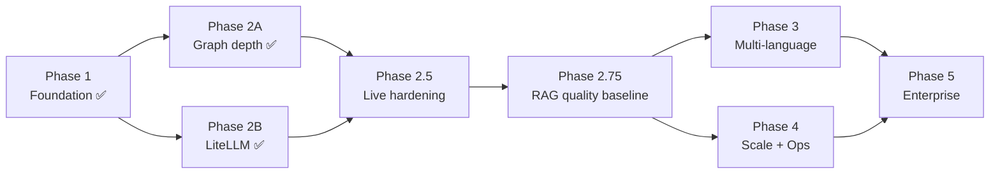

# 🗺️ Roadmap — Sequenced Delivery Plan

> [!abstract] How to read this
> Five phases, each shippable and independently valuable. Every item references a fully specified work package (WP) in the plan documents — hand the WP section directly to Codex (GPT-5.5) or Claude Sonnet 5 as the task brief, together with the ground rules from [[00-Audit-Overview#📐 How the work packages are written|the overview]]. Checkboxes are Obsidian tasks — track progress here.

## Phase 1 — Fix the foundation (1–2 weeks)
*Theme: the graph tells the truth, and ingestion doesn't melt.*

- [x] [[02-Graph-Depth-Analysis#WP-G1 — Async functions + richer metadata|WP-G1]] Async functions + metadata + rstrip bug (fixes F-01, F-05)
- [x] [[01-Codebase-Audit-Findings#F-12 · Graph traversal starts from ONE arbitrary seed|F-12]] Multi-seed traversal (one-liner class of fix, big quality win)
- [x] [[04-Scalability-Plan#WP-S1 — Make graph build O(N)|WP-S1]] O(N) graph build + ignore semantics + benchmark harness
- [x] [[04-Scalability-Plan#WP-S2 — Batch embedding + persistence|WP-S2]] Batch embedding/persistence, kill dual-write
- [x] [[04-Scalability-Plan#WP-S3 — Transactional, bulk graph persistence|WP-S3]] Atomic bulk persistence + per-repo lock
- [x] [[04-Scalability-Plan#WP-S4 — ANN index + query-path hygiene|WP-S4]] HNSW index + real filter columns (typed filter columns landed later as WP-S4B)
- [x] [[05-Enterprise-Platform-Plan#WP-E2 — Deployability images, config, CI|WP-E2 (CI part)]] Working CI (F-17) — do early so all later WPs land gated

**Exit criteria:** benchmark repo (2k files) ingests < 2 min; vector search uses index; CI green on every PR. **Met** — see `DOCS/test_results/Phase-1-Exit-Report.md`.

## Phase 2 — Graph depth + LLM freedom (2–3 weeks, two parallel tracks)
*Theme: answers get materially better.*

**Track A — graph (sequential):**
- [x] [[02-Graph-Depth-Analysis#WP-G3 — Remove CALL nodes from identity space; keep call sites as evidence|WP-G3]] Call-site model fix (F-03)
- [x] [[02-Graph-Depth-Analysis#WP-G2 — Materialize `IMPORTS` edges|WP-G2]] IMPORTS edges (F-02)
- [x] [[02-Graph-Depth-Analysis#WP-G4 — Scope- and import-aware call resolution (implement ADR-032 fully)|WP-G4]] Real call resolution (F-04)
- [x] [[02-Graph-Depth-Analysis#WP-G5 — `INHERITS` and `OVERRIDES` edges|WP-G5]] Inheritance edges
- [x] [[02-Graph-Depth-Analysis#WP-G6 — Traversal layer catches up with the deeper graph|WP-G6]] Traversal strategies catch up

**Track B — LLM (independent, small):**
- [x] [[06-LLM-Provider-LiteLLM-Plan#WP-M1 — LiteLLM core swap|WP-M1]] LiteLLM swap
- [x] [[06-LLM-Provider-LiteLLM-Plan#WP-M2 — Resilience fallbacks, retries, timeouts|WP-M2]] Fallbacks/retries
- [x] [[06-LLM-Provider-LiteLLM-Plan#WP-M5 — Model switching in the product surface|WP-M5]] Model picker
- [x] *(beyond original scope)* Multi-endpoint routing shipped in PR #47 — env-activated Tailscale Ollama default with fallback chain; Groq/NVIDIA NIM first-class support tracked separately as issue #46

**Exit criteria:** "what calls X" correct on eval fixtures incl. methods & cross-file; any cloud model usable by alias. **Met.**

## Phase 2.5 — Live hardening (unplanned, reactive; shipped 2026-07-19/20)
*Theme: bugs that only surfaced once the merged stack ran end-to-end in Docker.*

- [x] Issue #30 (5 parts): repo_id dropped in the query path, caller routing, context caps, source labels, repo metadata
- [x] PR #40: sources resolving to UUIDs instead of names (nested `metadata.source_metadata` bug)
- [x] PR #42: fallback-chain timeout regression from the LiteLLM swap (503s on CPU Ollama)
- [x] PR #47: multi-endpoint LiteLLM routing (Tailscale remote Ollama default + fallback)
- [x] Finish the remaining live-smoke-test acceptance items before starting Phase 3/4 work (issue #48, closed 2026-07-20):
  - [x] Subclass/override graph expansion firing correctly at low `top_k` — found and fixed a real bug (module/class-level seed mismatch broke `INHERITS`/`OVERRIDES` traversal), PR #51
  - [x] Two-repository source isolation (no cross-repo leakage) — verified clean
  - [x] Model-alias switching (default vs. explicit `ollama/...`, forced fallback via `model=smart`) — verified correct
  - [x] Gradio UI visual pass (labels, model dropdown, model-used line) — confirmed via screenshot

**Exit criteria met.** Also surfaced and filed issue #52 (Dockerfile `CMD` ignores the dev bind-mount, so `restart` never picks up code edits — only a rebuild does; closed 2026-07-20, PR #54) and, while verifying that fix live, issue #41 (each of `ingestion_service`/`llm_service`/`rag_orchestrator` resolves its own uv environment fresh at every container start instead of baking it into the image — still open). Investigating #41 surfaced two further, independently-closable bugs: issue #55 (`rag_orchestrator` resolving the CUDA-enabled `torch` build instead of CPU-only — closed 2026-07-21, PR #56) and issue #57 (the same latent gap in `ingestion_service`, plus a `torchvision` ABI mismatch found while fixing it — closed 2026-07-21).

## Phase 2.75 — RAG quality baseline (empirical, precedes any Phase 4 reranker work)
*Theme: prove the system retrieves the right evidence and answers well before changing anything else.*

- [x] [[08-RAG-Quality-Evaluation-Methodology#0 · Recommended execution order (WP-Q0)|WP-Q0]] Build curated eval corpus + run the unified chunking/retrieval/generation pass, classify every failure (tracked as issue #49)
- [x] Reranker go/no-go decision recorded per [[08-RAG-Quality-Evaluation-Methodology#4 · Reranker decision gate|the decision gate]]

**Exit criteria met — verdict: NO-GO on the reranker.** 9/10 known-answer
questions passed end-to-end against `shared/smoke_repo` + 3 docs; the one
failure classified `top-3-but-poor-answer` (confirmed via clean-context test
as a context-composition/distractor problem, not retrieval or generation
capability) — zero questions landed in the rank-8-20 bucket a reranker could
address. Next lever: prompting/context assembly, not `WP-S8`'s reranker
(implemented 2026-08-30 as issue #79 — see below).
Recall@5 measured at 70% via raw vector similarity alone vs. 90% via
production's actual path (graph expansion recovers two of the three misses)
— direct empirical evidence for the graph-aware architecture. Full evidence:
`DOCS/test_results/2026-08-27-wp-q0-rag-quality-baseline.md`. Also surfaced
and filed issue #64 (code-query seed search's `doc_type` filter never
matches its intended value, silently falling back on every code query) and
issue #65 (near-duplicate chunk crowding from module/sole-child artifact
embedding — a retrieval-quality/indexing finding, not a correctness bug).
Neither fixed as part of WP-Q0, per its evaluation-only scope — **both since
fixed** (2026-08-29): issue #64 in [#72](https://github.com/sankar-ramamoorthy/rag-foundry-universal/pull/72),
issue #65 in [#73](https://github.com/sankar-ramamoorthy/rag-foundry-universal/pull/73).
The Q7 next-lever finding itself (context-assembly conflation) is also
since fixed (2026-08-30): [issue #79](https://github.com/sankar-ramamoorthy/rag-foundry-universal/issues/79),
per-chunk source labeling in the assembled prompt.
See [[00-Audit-Overview]]'s 2026-08-30 status.

**Exit criteria:** every eval-corpus failure is classified (chunking/retrieval/filtering/ranking/generation); `WP-S8`'s reranker sub-task in Phase 4 either proceeds with evidence or is explicitly deferred with a recorded reason.

## Phase 3 — Multi-language (4–6 weeks)
*Theme: the headline feature.*

- [x] [[03-Multi-Language-Graph-Plan#WP-L1 — IR + GraphAssembler refactor (the enabler)|WP-L1]] IR + GraphAssembler (absorbs Track A learnings) — done 2026-08-30, issue #81
- [ ] [[03-Multi-Language-Graph-Plan#WP-L2 — tree-sitter runtime + TypeScript/JavaScript extractor (first new language)|WP-L2]] TypeScript/JavaScript
- [ ] [[03-Multi-Language-Graph-Plan#WP-L3 — Rust extractor|WP-L3]] Rust
- [ ] [[03-Multi-Language-Graph-Plan#WP-L4 — Java extractor|WP-L4]] Java
- [ ] [[03-Multi-Language-Graph-Plan#WP-L6 — Query/UI awareness of language|WP-L6]] Language filters
- [ ] [[03-Multi-Language-Graph-Plan#WP-L5 — Python on tree-sitter (parity migration, last)|WP-L5]] Python parity migration (can slip to Phase 5)

**Exit criteria:** a polyglot fixture monorepo (py+ts+rs+java) ingests into one graph; language-filtered queries work; golden-file determinism suite green.

## Phase 4 — Scale + operate (3–4 weeks, parallel with late Phase 3)
*Theme: survives real repos and real ops.*

- [ ] [[04-Scalability-Plan#WP-S5 — Job queue for ingestion|WP-S5]] Job queue (arq + Redis)
- [ ] [[04-Scalability-Plan#WP-S6 — Incremental ingestion (the massive-repo unlock)|WP-S6]] Incremental ingestion + snapshot lineage
- [ ] [[04-Scalability-Plan#WP-S7 — Bounded graph service instead of whole-graph-in-RAM|WP-S7]] Traverse endpoint, kill whole-graph RAM cache
- [ ] [[04-Scalability-Plan#WP-S8 — Retrieval quality/perf at scale|WP-S8]] Concurrent fetch, real tokenizer, reranker flag (reranker sub-task gated on Phase 2.75's eval — see above)
- [ ] [[05-Enterprise-Platform-Plan#WP-E1 — Security baseline (do first, small)|WP-E1]] Security baseline *(can and should be pulled earlier if anything is network-exposed)*
- [ ] [[05-Enterprise-Platform-Plan#WP-E5 — Observability|WP-E5]] Observability
- [ ] [[06-LLM-Provider-LiteLLM-Plan#WP-M3 — Streaming|WP-M3]] / [[06-LLM-Provider-LiteLLM-Plan#WP-M4 — Cost & usage telemetry|WP-M4]] Streaming + cost telemetry

**Exit criteria:** 1M-LOC monorepo cold-ingests < 30 min; 1-file PR re-ingests < 30 s; traces + dashboards live; nothing unauthenticated.

## Phase 5 — Enterprise product (5–8 weeks)
*Theme: something a team can buy and log into.*

- [ ] [[05-Enterprise-Platform-Plan#WP-E2 — Deployability images, config, CI|WP-E2 (deploy part)]] Helm/K8s deployment + reproducible builds (issue #41: bake each service's own `uv` env into the image at build time instead of re-resolving at container start; fix the malformed compose healthchecks)
- [ ] [[05-Enterprise-Platform-Plan#WP-E3 — Identity & multi-tenancy|WP-E3]] OIDC + teams + repo grants + audit log
- [ ] [[05-Enterprise-Platform-Plan#WP-E4 — Private git-host integration|WP-E4]] Private repos, then GitHub App + PR comments *(the vision-doc killer feature)*
- [ ] [[05-Enterprise-Platform-Plan#WP-E6 — Product web UI (replace Gradio)|WP-E6]] React web UI with streaming + graph explorer

**Exit criteria:** demo flow — SSO login → connect private polyglot repo → nightly incremental ingest → PR opened → bot comments callers-of-changed-code → dev asks follow-ups in web UI with model of choice.

---

## Dependency graph (phases)

> [!warning] Two rules that keep this roadmap honest
> 1. **Nothing ships without its benchmark/eval delta recorded** (`DOCS/test_results/`). Phase 1 builds the harness; every later WP reports against it.
> 2. **Graph-depth work after Phase 2 goes through the IR** ([[03-Multi-Language-Graph-Plan]]) — no more Python-only resolution code once WP-L1 lands.
> 3. **Phase 4's reranker sub-task (`WP-S8`) does not start until Phase 2.75 proves it's the actual bottleneck** — see [[08-RAG-Quality-Evaluation-Methodology]].

> [!note] Current next steps (2026-08-27)
> 1. ~~Finish the four remaining Phase 2.5 smoke-test items~~ — done, issue #48 closed.
> 2. ~~Run Phase 2.75's `WP-Q0` eval pass and record a reranker go/no-go decision~~ — done: **NO-GO on the reranker**, see Phase 2.75 above (issue #49, `DOCS/test_results/2026-08-27-wp-q0-rag-quality-baseline.md`).
> 3. Phase 3/4 work may resume — but `WP-S8`'s reranker sub-task specifically stays deferred per the NO-GO verdict. ~~The identified next lever is prompting/context assembly, tracked via issues #64 and #65~~ — #64 and #65 are done (2026-08-29, PRs #72/#73); ~~the remaining next lever is prompting/context assembly for chunks that share surface phrasing but describe different referents, not yet filed as its own issue~~ — done (2026-08-30, issue #79): chunks are now labeled by source in the assembled prompt.
> 4. ~~Issue #52 (dev bind-mount ignored by `CMD`)~~ — done, closed 2026-07-20 (PR #54). ~~Issue #55 (rag_orchestrator CUDA torch)~~ and ~~issue #57 (ingestion_service CUDA torch + torchvision ABI mismatch)~~ — done, closed 2026-07-21. Issue #41 (per-service uv env re-resolved fresh at every container start, plus the malformed compose healthchecks) stays open but is **deliberately deferred to Phase 5's `WP-E2` deploy part** (see below) — it's the "reproducible builds" work the WP already scopes, not urgent now that #55/#57 removed the multi-GB CUDA cost from every recreate.
> 5. Phase 3 has begun: `WP-L1` (issue #81, 2026-08-30) landed the IR + `GraphAssembler` refactor — verified behavior-identical against four real codebases (Python and Markdown) ingested pre- and post-refactor. Next: `WP-L2` (TypeScript/JS extractor), not yet started.

