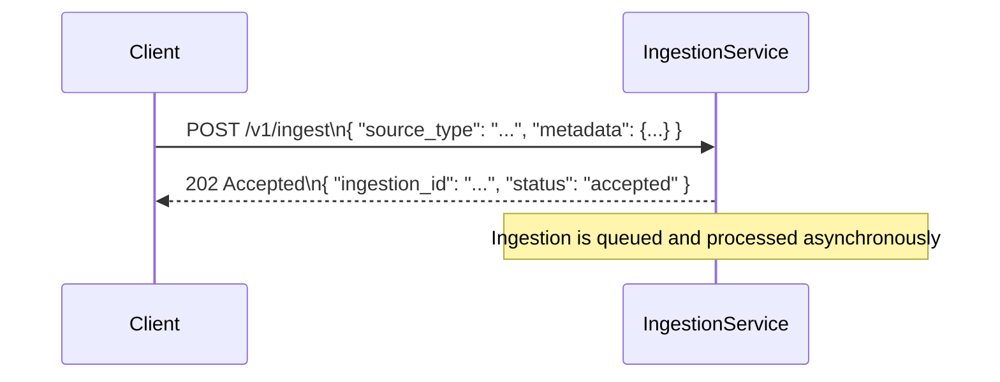

---

# Ingestion Service API Contract

## Overview

The ingestion service exposes a **versioned HTTP API** for submitting documents or content for ingestion.
All ingestion requests are **accepted asynchronously**; downstream consumers receive a server-generated `ingestion_id`.

* **Base URL:** `/v1`
* **Service:** `Agentic RAG Ingestion Service`
* **Current Version:** v1

---

## Endpoints

### 1. Submit Ingestion

**POST** `/v1/ingest`

#### Description

Submit a content item for ingestion. The service validates the request and returns a unique ingestion ID. Actual ingestion is asynchronous and out of scope.

#### Request

| Field         | Type                           | Required | Description                                                   |
| ------------- | ------------------------------ | -------- | ------------------------------------------------------------- |
| `source_type` | `"file"` | `"bytes"` | `"uri"` | Yes      | Type of source being ingested |                                 |
| `metadata`    | `dict[str, any]`               | No       | Optional user-provided metadata associated with the ingestion |

**Example JSON request**

```json
{
  "source_type": "file",
  "metadata": {
    "user": "alice",
    "project": "example"
  }
}
```

#### Response (202 Accepted)

| Field          | Type         | Description                                                 |
| -------------- | ------------ | ----------------------------------------------------------- |
| `ingestion_id` | `UUID`       | Server-generated identifier for this ingestion request      |
| `status`       | `"accepted"` | Indicates the ingestion request was accepted for processing |

**Example JSON response**

```json
{
  "ingestion_id": "550e8400-e29b-41d4-a716-446655440000",
  "status": "accepted"
}
```

#### Error Responses

| Status | Error Code        | Description                                          |
| ------ | ----------------- | ---------------------------------------------------- |
| 400    | `INVALID_REQUEST` | Request failed validation; missing or invalid fields |
| 500    | `INTERNAL_ERROR`  | Unexpected server error during request handling      |

**Example 400 Response**

```json
{
  "error_code": "INVALID_REQUEST",
  "message": "Request validation failed",
  "details": {
    "errors": [
      {
        "type": "missing",
        "loc": ["body", "source_type"],
        "msg": "Field required",
        "input": {}
      }
    ]
  }
}
```

**Example 500 Response**

```json
{
  "error_code": "INTERNAL_ERROR",
  "message": "Internal server error",
  "details": null
}
```

---

### Notes

* 422 validation errors currently return FastAPI default schema (`HTTPValidationError`). Future versions may override this to return `ErrorResponse`.
* All requests and responses use **JSON**.
* Endpoint is **idempotent in acceptance** — multiple submissions are allowed and each generates a unique `ingestion_id`.

---

## Ingestion Flow Diagram




---

### How it works

1. **Client submits** a POST request with `source_type` and optional `metadata`.
2. **IngestionService validates** the request.
   - If invalid → responds with `INVALID_REQUEST` (400).
   - If exception occurs → responds with `INTERNAL_ERROR` (500).
3. **IngestionService returns** `202 Accepted` with `ingestion_id`.
4. Actual processing happens asynchronously (out of scope for MS1).

---
